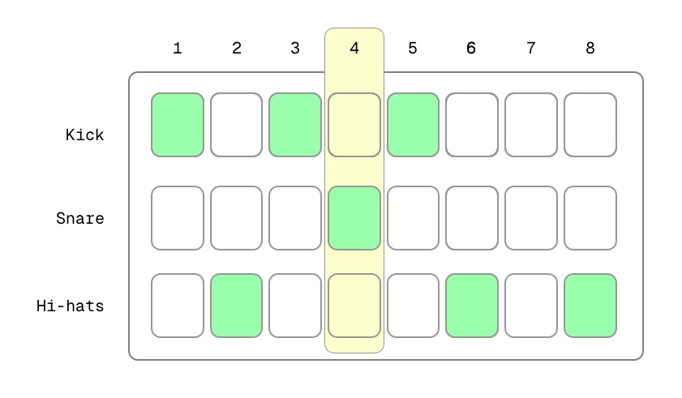
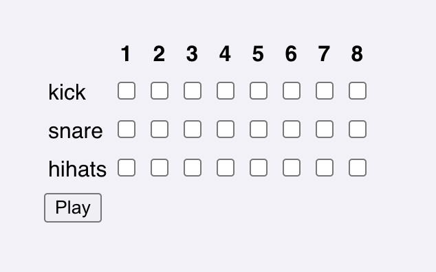

import PostAccordion from '../../components/PostAccordion.astro';

I've always been curious about the [**Web Audio API**](https://developer.mozilla.org/en-US/docs/Web/API/Web_Audio_API); there's something about creating beats and sounds from scratch that is exhilarating, and the idea of doing it in JS really tickled my brain.

Lately I've had some time to play around with it, and I've decided to document the experimentation process and its results. Perhaps someone sharing my curiosity will find it useful or interesting!

## Deciding what to build

I wanted to build something fairly simple, yet fun to play with. I thought it'd be a fun idea to synthetize some drum beats and fit them into a simple sequencer. Here's a sketch of what I visualized in my mind when thinking about the UI:



This is a pretty standard layout for sequencers or drum machines: each button column is a step in the sequence, and every row a different sound. While the sequence is playing, the active step would be highlighted.

<PostAccordion title="So... what is a sequencer?" client:load>
  Generally speaking, an audio sequencer is a device or software which can record and/or play back sounds in a particular order. Sequencing is one of the foundational blocks of electronic music: it allows programming the reproduction of a specific sound at a specific time.

</PostAccordion>

I also set a few requirements for myself:

#### No React (or other frameworks)

We're manipulating and playing audio through time, which is a CPU-bound activity; JavaScript is notoriously not great when it comes to
being precise about time, being a single threaded language. Because of that, I wanted to minimize all the CPU overhead that could pile up on the main thread, including UI frameworks like React. This also gave me an opportunity to use [Astro's vanilla setup](/posts/astro).

#### No Web Audio libraries or wrappers (like [Tone.js](https://tonejs.github.io))

I wanted to build something from "first principles" and learn through that. Using a library like Tone.js would be kinda like cheating :)

#### No help from AI

The reason why I got into this is because I want to take the time to learn a new API, build something from scratch and have some fun in doing so. I personally find this process very satisfying, and consider it a sort of _brain workout_ that helps me keep my mind sharp. I didn't have any rush to finish this, so I decided not to use AI to help with the code because it wouldn't have been as fun for myself.

## The markup

```js
const STEPS_LENGHT = 8;
const STEPS_ARRAY = Array.from({ length: STEPS_LENGHT }, (_, i) => i + 1);
const INSTRUMENTS = ['kick', 'snare', 'hihats'];
```

```jsx
<table>
  <thead id="steps">
    <tr>
      <td></td>
      {
        STEPS_ARRAY.map(step => (
          <th scope="col" data-step={step}>
            {step}
          </th>
        ))
      }
    </tr>
  </thead>
  <tbody>
    <tr id="kick">
      <th scope="row">Kick</td>
      {STEPS_ARRAY.map(step => (
        <td>
          <input data-kick-step={step} type="checkbox" />
        </td>
      ))}
    </tr>
    <tr id="snare">
      <th scope="row">Snare</td>
      {STEPS_ARRAY.map(step => (
        <td>
          <input data-snare-step={step} type="checkbox" checked />
        </td>
      ))}
    </tr>
    <tr id="hihats">
      <th scope="row">Hi-hats</td>
      {STEPS_ARRAY.map(step => (
        <td>
          <input data-hihats-step={step} type="checkbox" />
        </td>
      ))}
    </tr>
  </tbody>
</table>
```

Which we can further refactor to abstract the markup for each instrument row by leveraging JSX (and the object spread operator):

```jsx
<table>
  <thead id="steps">
    <td></td>
    {
      STEPS_ARRAY.map(step => (
        <th scope="col" data-step={step}>
          {step}
        </th>
      ))
    }
  </thead>
  <tbody>
    {
      INSTRUMENTS.map(instrument => (
        <tr id={instrument}>
          <td scope="row">{instrument}</td>
          {STEPS_ARRAY.map(step => {
            const attributes = {
              [`data-${instrument}-step`]: step,
              type: 'checkbox' as const,
            };
            return (
              <td>
                <input {...attributes} />
              </td>
            );
          })}
        </tr>
      ))
    }
  </tbody>
</table>
```

And this is what we ended up with – pretty bare, but we can worry about the styling later :)



## The
