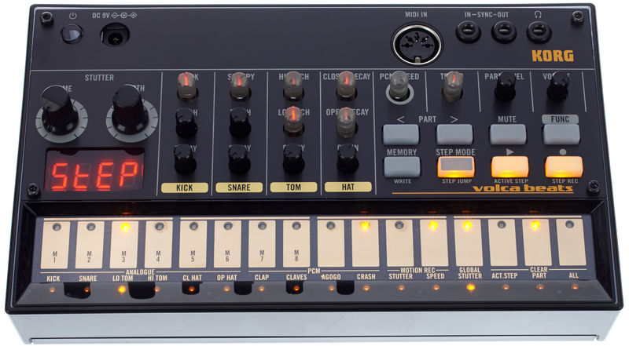

I've always been curious about the [**Web Audio API**](https://developer.mozilla.org/en-US/docs/Web/API/Web_Audio_API); there's something about creating beats and sounds from scratch that is exhilarating, and the idea of doing it in JS really tickled my brain.

Lately I've had some time to play around with it, and I've decided to document the experimentation process and its results. Perhaps someone sharing my curiosity will find it useful or interesting!

## What to build?

I wanted to build something fairly simple, yet fun to play with. What better than a sequencer reproducing some drum beats?



```astro

```

## The markup

```
const STEPS_LENGHT = 8;
const STEPS_ARRAY = Array.from({ length: STEPS_LENGHT }, (_, i) => i + 1);
const INSTRUMENTS = ['kick', 'snare', 'hihats'];
```

```jsx
<table>
  <thead id="steps">
    <tr>
      <td></td>
      {
        STEPS_ARRAY.map(step => (
          <th scope="col" data-step={step}>
            {step}
          </th>
        ))
      }
    </tr>
  </thead>
  <tbody>
    <tr id="kick">
      <th scope="row">Kick</td>
      {STEPS_ARRAY.map(step => (
        <td>
          <input data-kick-step={step} type="checkbox" />
        </td>
      ))}
    </tr>
    <tr id="snare">
      <th scope="row">Snare</td>
      {STEPS_ARRAY.map(step => (
        <td>
          <input data-snare-step={step} type="checkbox" checked />
        </td>
      ))}
    </tr>
    <tr id="hihats">
      <th scope="row">Hi-hats</td>
      {STEPS_ARRAY.map(step => (
        <td>
          <input data-hihats-step={step} type="checkbox" />
        </td>
      ))}
    </tr>
  </tbody>
</table>
```

Which we can further refactor to abstract the markup for each instrument row by leveraging JSX (and the object spread operator):

```jsx
<table>
  <thead id="steps">
    <td></td>
    {
      STEPS_ARRAY.map(step => (
        <th scope="col" data-step={step}>
          {step}
        </th>
      ))
    }
  </thead>
  <tbody>
    {
      INSTRUMENTS.map(instrument => (
        <tr id={instrument}>
          <td scope="row">{instrument}</td>
          {STEPS_ARRAY.map(step => {
            const attributes = {
              [`data-${instrument}-step`]: step,
              type: 'checkbox' as const,
            };
            return (
              <td>
                <input {...attributes} />
              </td>
            );
          })}
        </tr>
      ))
    }
  </tbody>
</table>
```

And this is what we ended up with – pretty bare, but we can worry about the styling later :)


## The
